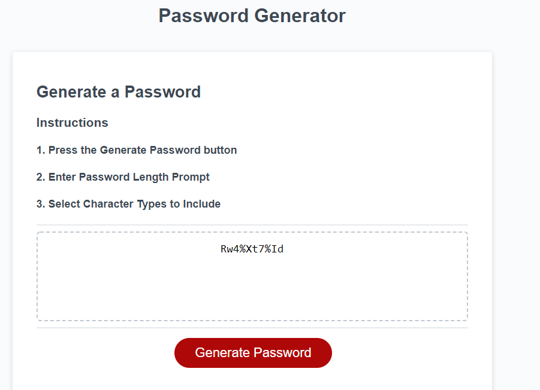

# Password Generator Starter Code

## Table of Contents
* Overview
* Technologies
* Status
* Screenshot

## Overview
The goal of this website is to generate a password between 8-128 characters using uppercase, lowercase, numbers, and special characters.

## Technologies
Project created with:
* HTML
* Javascript

## Status
Please use link for finished project. I will continue to add to this, as I get more confident in using Javascript. The screenshot shows the end result of the password generator.

[Password Generator](https://achung92.github.io/password-generator/)

## Screenshot

